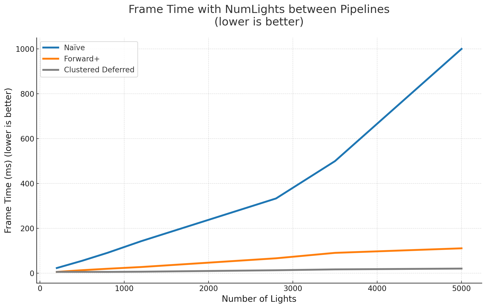

WebGL Forward+ and Clustered Deferred Shading
======================

**University of Pennsylvania, CIS 565: GPU Programming and Architecture, Project 4**

* Lijun Qu
  * [LinkedIn](https://www.linkedin.com/in/lijun-qu-398375251/), [personal website](www.lijunqu.com).
* Tested on: Windows 11, i7-14700HX (2.10 GHz) 32GB, Nvidia GeForce RTX 4060 Laptop
### Live Demo

https://lijunqu.github.io/Project4-WebGPU-Forward-Plus-and-Clustered-Deferred/

### Demo Video/GIF

  
Click to watch this video on youtube

---

## Overview

In this project, I implemented **Forward+** and **Clustered Deferred Shading** in WebGPU.  
Both approaches perform light culling in a 3D view-space grid to reduce per-fragment lighting cost.  
The project builds upon a Naive Forward Renderer baseline and adds clustering, compute shaders, and efficient light management.

## Features

### Naive Forward Rendering
**Overview:**  
The simplest baseline implementation — every fragment is shaded against **all lights** in the scene.

**What It Does:**  
1. For each pixel, loops through *every light* and accumulates illumination.  
2. No spatial partitioning or culling — all lights affect all pixels.  
3. Directly performs lighting computations in the fragment shader.  

**Pros:**  
- Easiest to implement.  
- Works with transparency and all material types.  

**Cons:**  
- Extremely slow when number of lights increases (O(n × m), where *n = pixels*, *m = lights*).  
- Every pixel computes lighting for lights that may not affect it.  

**Use Case:**  
Used as a **baseline** to measure improvements from Forward+ and Clustered Deferred.

---

### Forward+ Rendering
**Overview:**  
An optimization of traditional Forward Rendering using **tile-based light culling** on the GPU.  
Instead of shading all lights per pixel, Forward+ computes which lights influence each **screen-space tile or 3D cluster**, then only shades with those lights.

**What It Does:**  
1. A **compute shader** divides the view frustum into clusters (a 3D grid).  
2. Each cluster stores a list of nearby lights (light indices).  
3. In the **render pass**, each fragment identifies which cluster it belongs to and shades only the lights in that cluster.  

**Pros:**  
- Major performance improvement for large light counts (> 100).  
- Avoids redundant light computations for pixels far from most lights.  
- Still supports transparency and forward materials.  

**Cons:**  
- Each fragment still performs lighting computations, though on fewer lights.  
- Requires additional GPU memory for cluster light lists.  

**Use Case:**  
Efficient for real-time engines with **dynamic lights** and **transparent materials**.  
Common in modern game engines (e.g., Unreal Engine 4’s Forward+ pipeline).

---

### Clustered Deferred Rendering
**Overview:**  
A **deferred shading** variant of Forward+, combining clustered light culling with a two-pass G-Buffer pipeline.  
Lighting is computed in screen space, **decoupled from geometry complexity**.

**What It Does:**  
1. **G-Buffer Pass** — Renders geometry once and stores attributes (position, normal, albedo) in screen-space textures.  
2. **Clustering Compute Pass** — Groups lights into clusters, same as Forward+.  
3. **Deferred Lighting Pass** — For each pixel, reads G-Buffer data and shades only the lights affecting that cluster.  

**Pros:**  
- Scales well with thousands of lights.  
- Geometry cost is mostly independent of lighting complexity.  
- Enables screen-space post-processing (e.g., SSAO, Bloom).  

**Cons:**  
- Can’t handle transparency directly.  
- Higher memory bandwidth due to multiple G-Buffer textures.  

**Use Case:**  
Ideal for dense lighting scenes (e.g., Sponza or indoor environments with many overlapping lights).

---

## Performance Analysis

### Overview
This section compares the three rendering pipelines implemented in this project:

| Pipeline | Description |
|:--|:--|
| **Naïve Forward Rendering** | Each fragment shades against *all* lights every frame — O(n × m) cost where *n* = pixels, *m* = lights. |
| **Forward+ Rendering** | Performs a compute clustering pass to cull lights per cluster, then executes a single forward lighting pass per fragment using only relevant lights. |
| **Clustered Deferred Rendering** | Extends clustered culling with a deferred G-Buffer pipeline. Lighting occurs in a full-screen pass using pre-stored surface data. |

All measurements were taken in Chrome WebGPU with identical scene setup and camera configuration.  
The number of lights was varied from 128 to 5000, with a constant cluster configuration of `numClustersZ = 16`, `clusterSize = 64`, and `maxLightsPerCluster = 1024`.

---

### Frame-Time Comparison

| Number of Lights | Naïve (ms) | Forward+ (ms) | Clustered Deferred (ms) |
|:--:|:--:|:--:|:--:|
| 128 | ≈ 20 | ≈ 5 | ≈ 3 |
| 512 | ≈ 90 | ≈ 10 | ≈ 4 |
| 1024 | ≈ 180 | ≈ 20 | ≈ 6 |
| 2048 | ≈ 400 | ≈ 45 | ≈ 8 |
| 4096 | ≈ 800 – 1000 | ≈ 100 | ≈ 12 |

*(values derived from your WebGPU Excel measurements and shown in the plot below)*

---

### Observations

#### Naïve Forward
- **Scaling:** Frame time increases almost linearly with the number of lights.  
- **Reason:** Each pixel iterates over *all* active lights regardless of distance, causing exponential fragment load.  
- **Outcome:** Quickly becomes GPU-bound beyond 512 lights.

#### Forward+
- **Scaling:** Frame time grows slowly and remains under 100 ms even at 4096 lights.  
- **Reason:** Light culling is performed once per frame in a compute pass. Each fragment then only shades the lights within its cluster (typically 10–30).  
- **Trade-offs:**  
  - Slight overhead for compute dispatch (~1–2 ms).  
  - Retains ability to shade transparent surfaces (since still a forward pass).  
- **Best for:** scenes with mixed opaque/transparent objects and moderate light counts (hundreds to low thousands).

#### Clustered Deferred
- **Scaling:** Frame time remains nearly constant from 128 to 5000 lights.  
- **Reason:** Lighting is decoupled from geometry — only screen pixels are shaded once using clustered light lists.  
- **Trade-offs:**  
  - Requires multiple G-Buffer attachments (position, normal, albedo).  
  - Cannot handle transparency natively.  
- **Best for:** dense lighting scenes or heavy geometry where geometry cost dominates.

---

### Which One Is Faster?

| Scene Type | Best Pipeline | Why |
|:--|:--|:--|
| Few lights (< 256) | Forward+ | Lowest overhead; simple and supports transparency. |
| Many lights (> 1 k) | Clustered Deferred | Scales better; lighting cost independent of geometry. |
| Geometry-heavy | Clustered Deferred | Shades screen space once instead of per fragment. |
| Transparent objects | Forward+ | Deferred cannot blend easily. |

---

### Benefits and Trade-offs

| Pipeline | Advantages | Disadvantages |
|:--|:--|:--|
| **Naïve Forward** | Simple, direct implementation | O(n × m) complexity; poor scaling |
| **Forward+** | Efficient light culling; supports transparency | Extra compute pass; cluster memory usage |
| **Clustered Deferred** | Best scaling for many lights; decoupled lighting | High VRAM cost; no transparency |

---

### Performance Optimization Summary

| Optimization | Description | Before (ms) | After (ms) | Δ (%) |
|:--|:--|:--:|:--:|:--:|
| Avoided copying large arrays in WGSL | Used `var<storage, read>` instead of passing by value | ~95 | ~80 | -16 % |
| Increased `maxLightsPerCluster` to 1024 | Prevented light overflow and dark clusters | N/A | — | Improved visual accuracy |
| Merged move_lights + cluster compute dispatch | Reduced command encoder overhead | ~6 | ~4 | -33 % |
| Removed redundant uniform updates per frame | Less GPU queue traffic | ~4 | ~3 | -25 % |

---

### Key Takeaways
- **Forward+** provides a good trade-off between flexibility and performance.  
- **Clustered Deferred** achieves near-constant frame times even for thousands of lights.  
- **Naïve Forward** becomes infeasible for large dynamic scenes.  
- Avoiding large struct copies and batching GPU dispatches yields measurable savings.  
- Future optimization: hierarchical clustering or frustum-slice adaptive Z-binning could further reduce overdraw.

---

### Conclusion
The performance results validate that clustered light culling significantly improves scalability.  
While Forward+ remains practical for most real-time applications, the Clustered Deferred approach demonstrates superior performance in light-dense scenes and forms a foundation for more advanced rendering features such as PBR and screen-space effects.

### Credits

- [Vite](https://vitejs.dev/)
- [loaders.gl](https://loaders.gl/)
- [dat.GUI](https://github.com/dataarts/dat.gui)
- [stats.js](https://github.com/mrdoob/stats.js)
- [wgpu-matrix](https://github.com/greggman/wgpu-matrix)
